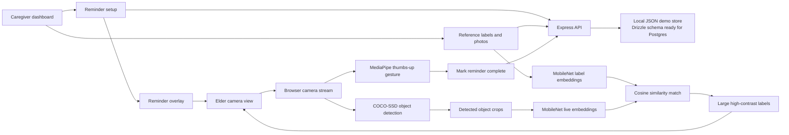

# Architecture

Eyes Open is designed as a privacy-conscious assistive AI loop: caregivers author context, the browser performs recognition, and the elder-facing view presents only the minimum useful information.

## Runtime Boundaries

- Camera frames stay in the browser.
- TensorFlow.js and MediaPipe models are loaded only when recognition features need them.
- The server stores caregiver-authored reminders, labels, reference images, and last-seen timestamps.
- `.local/eyes-open-data.json` provides restart-safe local demos and is intentionally ignored by Git.

## Market-Ready Next Steps

- Replace local JSON persistence with Postgres through the existing Drizzle schema.
- Add caregiver accounts and permissions for real household use.
- Add an evaluation set for visual-label matching accuracy and gesture reliability.
- Add explicit consent/onboarding screens before camera activation.
- Add offline/PWA packaging for tablet-first caregiver and elder workflows.
