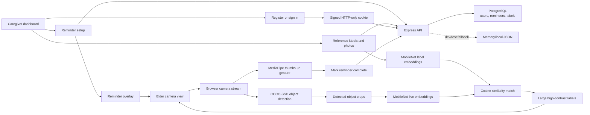

# Architecture

Eyes Open is designed as a privacy-conscious assistive AI loop: caregivers author context in a protected workspace, the browser performs recognition, and the elder-facing view presents only the minimum useful information.

## Runtime Boundaries

- Camera frames stay in the browser.
- TensorFlow.js and MediaPipe models are loaded only when recognition features need them.
- The server stores caregiver-authored reminders, labels, reference images, and last-seen timestamps.
- Reminder and label records are scoped by authenticated user ID.
- PostgreSQL is the production persistence path through `DATABASE_URL`.
- Memory/local JSON storage exists for development and automated tests only.

## Implemented Product Traits

- Authenticated caregiver accounts with signed HTTP-only sessions.
- User-isolated reminders and labels.
- Tested reminder create, complete, delete, and cross-user isolation.
- Tested large label image payload handling.
- Browser-side image resizing before label upload.
- Lazy-loaded AI models to keep the dashboard responsive.

## Model Readiness

The current stack is appropriate for a compelling prototype:

- COCO-SSD handles generic object detection.
- MobileNet embeddings support lightweight visual similarity for user-defined labels.
- MediaPipe Hands supports real-time hand landmark tracking for thumbs-up completion.

It is not enough to claim production accuracy on dementia-care recognition yet. To make that claim, add a labeled evaluation dataset, record precision/recall for label matching, test gesture completion across lighting and hand poses, and document device-specific latency.

## Market-Ready Next Steps

- Add caregiver invitation/household roles.
- Add consent/onboarding before camera activation.
- Add correction feedback when a label match is wrong.
- Add an evaluation harness for visual-label matching accuracy and gesture reliability.
- Package tablet-friendly PWA/offline behavior for home care use.
